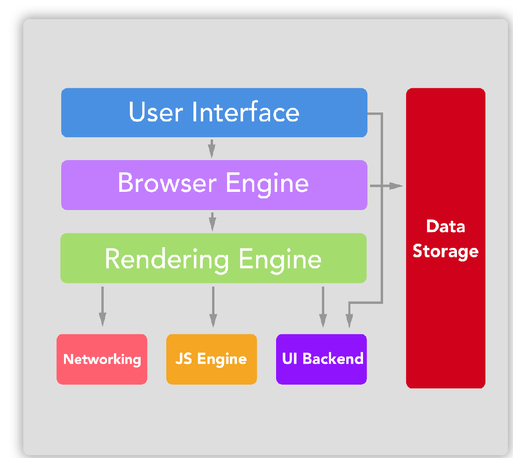
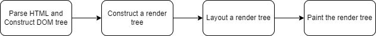
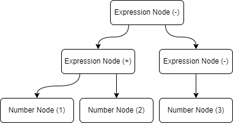
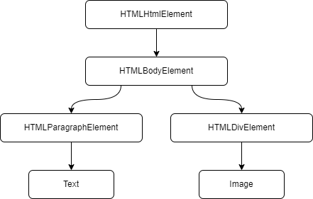
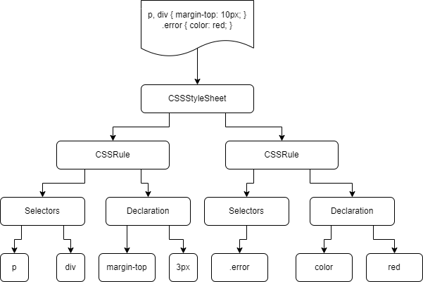

# Pesto Assignment - Week 1

# What is Web Browser? 

 A software application used to access information on the World Wide Web is called a Web Browser. When a user requests some
 information, the web browser fetches the data from a web server and then displays the webpage on the user’s screen. 

The purpose of a web browser is to fetch content from the Web or from a local storage device and display it on a user's device.


## What is the main functionality of the browser?

The main function of a browser is to present the web resource you choose, by requesting it from the server and displaying it in the browser window. The resource is usually an HTML document, but may also be a PDF, image, or some other type of content. The location of the resource is specified by the user using a URI (Uniform Resource Identifier).

The way the browser interprets and displays HTML files is specified in the HTML and CSS specifications. These specifications are maintained by the W3C (World Wide Web Consortium) organization, which is the standards organization for the web. For years browsers conformed to only a part of the specifications and developed their own extensions. That caused serious compatibility issues for web authors. Today most of the browsers more or less conform to the specifications.

## High Level Components of a browser

The browser's main components are:

1. The user interface: this includes the address bar, back/forward button, bookmarking menu, etc. Every part of the browser display except the window where you see the requested page.

2. The browser engine: marshals actions between the UI and the rendering engine.

3. The rendering engine: responsible for displaying requested content. For example if the requested content is HTML, the rendering engine parses HTML and CSS, and displays the parsed content on the screen

4. Networking: for network calls such as HTTP requests, using different implementations for different platform behind a platform-independent interface.

5. UI backend: used for drawing basic widgets like combo boxes and windows. This backend exposes a generic interface that is not platform specific. Underneath it uses operating system user interface methods.

6. JavaScript interpreter. Used to parse and execute JavaScript code.

7. Data storage. This is a persistence layer. The browser may need to save all sorts of data locally, such as cookies. Browsers also support storage mechanisms such as localStorage, IndexedDB, WebSQL and FileSystem.



## Rendering engine

As we saw above, the functionality of the rendering engine is to display the requested contents on the browser screen. It can have multiple instances running in the browser. For example, Chrome runs one instance per tab, so each tab runs in a separate process.

### What is an actual use of the rendering engine?

By default is supports displaying HTML, XML documents and images, but it can display other kind of documents too with the help of plug-ins/ extensions. We might have seen browsers displaying PDF as an example.

### Some existing rendering engines

- Trident - Internet Explorer
- Gecko - Firefox
- WebKit - Safari
- Blink (a fork of WebKit) - Chrome and Opera (from version 15)

### The journey from network to user interface

The rendering engine makes use of the networking layer to get the contents of the requested documents and this usually returns those contents in chunks. Then starts the process of Parsing -



It then parse the HTML document and convert elements to DOM nodes and forms a content tree using them. Then will parse the styling rules from both the external CSS as well as the `style` tags present in the received document. The information parsed from HTML and CSS is used to create the another tree called render tree.

#### Render tree

contains rectangles with visual attributes such as color and dimensions in the correct order to display on the screen.

After constructing a render tree, it starts the layout process where each node gets it's own position coordinates i.e. the place where it's going to be appeared on the screen.

The nodes in the render tree are then actually placed & painted on the interface using the UI Backend layer.

It's important to understand here that this is an iterative/ gradual process. As it receive chunks from the network layer, the rendering engine will try to display content on the screen as soon as it receives a single chunk of data to achieve better performance/ user experience. It won't wait for all the chunks to come in at once, instead it quickly starts processing an every single chunk as it comes in and it goes on untill the contents are coming from network.

## Parsers

Parsing a document means translating it to a structure the code can use. It results in a tree of nodes that represent the structure of the document, which is called a Parse/ Syntax tree.

For example, parsing the expression `1 + 2 - 3` could generate this tree -



## Grammar

Parsers are backed by a strong set of syntax rules that all the documents follows. That set of rules contains all the vocabulary specific to the document format and is called as Grammar.

Behind the scenes, parser is separated by 2 processes - lexical analysis and syntax analysis.

Lexical analysis is the process of breaking the input into the collection of valid building blocks, the tokens and see which all the tokens match the Grammar vocabulary. So, the component which does the lexical analysis is Lexer/ Tokenizer.

Syntax analysis checks the document for the language syntax rules. So, the component which does syntax analysis is Parser. It constructs the parse tree as a result of syntax analysis.

So every document goes through Lexical and Syntax analysis before the parse tree gets constructed.

## Translation

We need to understand that Parse tree isn't the final product, because the machine doesn't understand it, instead it needs it's own readable format. So here, translation comes into picture, it translates the parse tree into machine code.

## Types of Parsers

- Top down parser - where the start point is the highest level rule

- Bottom up/ Shift-reduce parser - scans the input until a rule is matched and then replaces the matching input with the rule until the end of the input. Here the input is shifted to right & gradually reduced to syntax rules that's why called Shift-reduce parser too.

### HTML Parser

The job of the HTML parser is to parse the HTML markup into a parse tree, conforming to the HTML syntax/ vocabulary defined by W3C organization.

The DOM has an almost one-to-one relation to the markup. For example:

```
<html>
    <body>
        <p>Hello World</p>
        <div></div>
    </body>
</html>
```

would be converted into following DOM tree -



### CSS Parser

Similar to the HTML Parser, the job of CSS parser is to parse CSS. It uses the lexical grammar defined by the regular expressions for each tokens such as identifier, classname etc.

Example:



## Script Processors

The script processor executes Javascript code to process an event.

When the browser processes an HTML document, it does so from top to bottom. Upon encountering a `<script>` tag, it halts/ blocks further processing in order to download the referenced script file. Only after that download has completed and the respective JavaScript code has been processed, HTML processing continues.

## Tree construction

While the DOM tree is being constructed, the browser constructs another tree, the render tree. This tree is of visual elements/ frames in the order in which they will be displayed. It is the visual representation of the document. The purpose of this tree is to enable painting the contents in their correct order.

The render tree is a subset of DOM tree. The un-rendered elements (display: none) won't be there in render tree but in DOM tree.

## Order of script processing

### Scripts

If the parsing of the scripts done synchronously, it halts the parsing until resource is fetched. So, with HTML5 it can be done asynchronously making it defer and no parsing is halted.

### Speculative parsing

This is an optimization technique used by WebKit and Firefox. The idea behind is to fetch resources through the parallel connections to get better speed. While executing scripts, another thread (speculative parser) parses the rest of the document and finds out what other external resources need to be loaded from the network and loads them.

### Style Sheets

The styles are need to be loaded beforehand the scripts. If not done, the script will get wrong answers and apparently this caused lots of problems on the user interface.

## Layout

When the renderer is created and added to the tree, it does not have a position and size. Calculating these values is called layout or reflow.

It is a recursive process. It begins at the root renderer, which corresponds to the `<html>` element of the HTML document. Layout continues recursively through some or all of the frame hierarchy, computing geometric information/ coordinates for each renderer that requires it.

### Global and incremental layout

Layout can be triggered on the entire render tree - this is "global" layout. This can happen as a result of:

A global style change that affects all renderers, like a font size change.
As a result of a screen being resized
Layout can be incremental, only the dirty renderers will be laid out (this can cause some damage which will require extra layouts).

Incremental layout is triggered (asynchronously) when renderers are dirty. For example when new renderers are appended to the render tree after extra content came from the network and was added to the DOM tree.

## Painting

In this stage, the render tree is traversed and the renderer's "paint()" method is called to display content on the screen. Painting uses the UI infrastructure/ backend component.

Like layout, painting can also be global - the entire tree is painted - or incremental. In incremental painting, some of the renderers change in a way that does not affect the entire tree.

